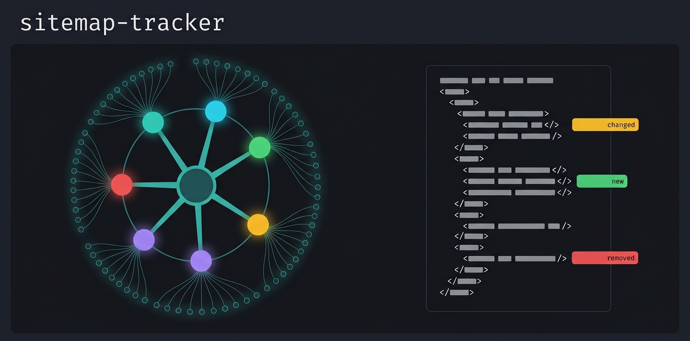

# Sitemap Tracker

<p align="center">
   <b>English</b> ·
   <a href="README.de.md">Deutsch</a>
</p>

---

<p align="center">
  
</p>

[](https://github.com/michaelblaess/sitemap-tracker/stargazers)
[](https://github.com/michaelblaess/sitemap-tracker/network/members)
[](https://github.com/michaelblaess/sitemap-tracker/issues)
[](https://github.com/michaelblaess/sitemap-tracker/pulls)

[](https://github.com/michaelblaess/sitemap-tracker/commits/main)
[](LICENSE)
[](https://www.python.org/)

Crawls websites and generates standard-compliant `sitemap.xml` files. Uses [Playwright](https://playwright.dev/) for JavaScript rendering or [httpx](https://www.python-httpx.org/) for fast HTTP crawling.

https://github.com/user-attachments/assets/0b77d4d9-a1e4-4e4e-8c07-654f9366beee

<p align="center"><sub><a href="https://youtu.be/LAu7BjM_fSE">Also on YouTube</a></sub></p>

## Screenshots

### Main View


### Sitemap Tree


### Crawl History


## Installation

### One-Liner (Standalone, no Python required)

**Linux / macOS:**
```bash
curl -fsSL https://raw.githubusercontent.com/michaelblaess/sitemap-tracker/main/install.sh | bash
```

**Windows (PowerShell):**
```powershell
irm https://raw.githubusercontent.com/michaelblaess/sitemap-tracker/main/install.ps1 | iex
```

> **Intel Macs:** the installer finds no package there. Release binaries are
> built for Apple Silicon (arm64) only, and Rosetta cannot help - it translates
> x86 to arm, not the other way round. Run from source instead: clone the
> repository, then `./bootstrap.sh` once and `./run.sh` to start. That route
> needs [uv](https://docs.astral.sh/uv/), which fetches the Python matching
> your processor.

### Run without installing (uv)

With [uv](https://docs.astral.sh/uv/) installed (Python 3.12 or newer):

```bash
uvx --from sitemap-tracker playwright install chromium   # once, fetches the browser
uvx sitemap-tracker
```

Or install it from [PyPI](https://pypi.org/project/sitemap-tracker/) with `pip install sitemap-tracker`, then run
`playwright install chromium` once.

## Usage

```bash
# Simple crawl (httpx mode, fast)
sitemap-tracker https://example.com

# With JavaScript rendering (Playwright)
sitemap-tracker https://example.com --render

# Save sitemap directly
sitemap-tracker https://example.com --output sitemap.xml

# Limit crawl depth
sitemap-tracker https://example.com --max-depth 5

# More concurrency
sitemap-tracker https://example.com --concurrency 16

# Ignore robots.txt
sitemap-tracker https://example.com --ignore-robots

# With cookies (e.g. for login)
sitemap-tracker https://example.com --cookie session=abc123
```

## CLI Parameters

| Parameter | Description | Default |
|---|---|---|
| `URL` | Start URL of the website | - |
| `--output`, `-o` | Output path for sitemap.xml | `sitemap_<host>_<timestamp>.xml` |
| `--max-depth`, `-d` | Maximum crawl depth | 10 |
| `--concurrency`, `-c` | Parallel requests | 8 |
| `--rate-limit` | Max requests per minute (0 = no limit) | 60 |
| `--timeout`, `-t` | Timeout per page (seconds) | 30 |
| `--render` | Render JavaScript with Playwright | off |
| `--no-headless` | Browser visible (debugging) | off |
| `--ignore-robots` | Ignore robots.txt | off |
| `--user-agent` | Custom User-Agent | Chrome 131 |
| `--cookie` | Set cookie (NAME=VALUE, multiple) | - |

## Keyboard Shortcuts (TUI)

| Key | Function |
|---|---|
| `c` | Start crawl (URL dialog) |
| `x` | Cancel crawl / JSON error report |
| `m` | Save sitemap (save-as dialog) |
| `s` | Settings |
| `g` | Export form report (JSON) |
| `j` | JIRA table to clipboard |
| `e` | Show errors only |
| `f` | Sitemap diff |
| `d` | Copy URL details |
| `l` | Toggle log |
| `h` | History |
| `z` | Crawl summary (score, findings) |
| `v` | Show the broken link in the referring page source (4xx/5xx rows) |
| `?` | HTTP status code reference |
| `i` | Info dialog |
| `q` | Quit |

Copying / exporting the log runs via right-click on the log panel.
Hovering a shortcut in the footer reveals a full tooltip explaining what it does.
URLs in the log, header and detail panel are clickable without holding Ctrl.

## Features

- **Dual mode**: httpx (fast, HTML only) or Playwright (JavaScript rendering)
- **robots.txt**: Respected by default, `--ignore-robots` to disable
- **Auto-split**: With >50,000 URLs, an automatic sitemap index with partial sitemaps
- **Priority**: Automatically based on crawl depth (home page = 1.0)
- **lastmod**: From HTTP Last-Modified header
- **URL normalization**: Duplicates avoided through normalization
- **Redirect-target resolution (same-host aliases)**: A sitemap normally lists only crawled HTTP-200 HTML pages — pure redirects (301/302) are left out, because they have no content of their own. But there is one special case: when a redirect points to a page **on the same host that is not otherwise listed** (an internal *alias*, e.g. `/old-path` → `/new-path` where `/new-path` is only reachable via the redirect), that resolved target would fall through the cracks and never end up in the sitemap. The writer therefore writes the **resolved target** into the sitemap instead of silently dropping the redirect. Three rules keep this safe and standard-compliant:
  1. **Already covered → skipped.** If the redirect resolves to a page that is already listed as a 200 page, it is dropped — scanning it again would just duplicate the existing page.
  2. **Same target → one entry.** Several redirects pointing at the same target collapse into a single sitemap entry.
  3. **Same host only.** Only targets on the **exact same host** are added. A `sitemap.xml` may, per the [sitemaps.org standard](https://www.sitemaps.org/protocol.html#location), only contain URLs from the host it lives on — so redirects to **sibling subdomains** (e.g. `www.blog.kunde.example` redirecting to `www.kunde.example` or `www.shop.kunde.example`) or to foreign domains are **excluded**. They belong in the sitemap of *their own* site, not this one. If you want those pages scanned, crawl that host directly.

  Note: the resolved target's *final* HTTP status is not re-fetched (the crawler only stored the original 301), so a broken same-host alias target shows up as an error in the downstream scan — which is exactly what you want to see.
- **Form detection**: `<form>` tags are detected, marked in the table and exportable as JSON
- **Dead-link source viewer**: For every 4xx/5xx page, jump to the referring page's HTML and see the exact line that contains the broken link — Pygments-highlighted, the match line painted in a warm gold band. From there: open the source in your browser, copy a paste-ready snippet (broken URL + ±3 lines of context + line number) to the clipboard, or save the full HTML as evidence
- **Results context menu**: Right-click on any results row for the five bulk actions (toggle errors-only filter, save sitemap as XML, save error report as JSON, copy JIRA table, generate forms report). 4xx/5xx rows additionally get a one-click jump into the broken-link source viewer
- **JIRA table in two formats** (Settings -> Export): **Markdown** for Jira Cloud (converts to a real table when pasted into a comment) and **Wiki markup** for older Jira Server/Data Center instances
- **Live TUI**: Progress, statistics and URL details in real time — results table and page tree split across two tabs
- **Sortable results**: Click any column header (Status, HTTP, Depth, Links, Form, Time, Size, Date, URL) to sort — second click reverses. Active column gets a ▲/▼ marker. Hovering the "Links" header shows a tooltip clarifying it counts the internal links found on the page
- **Crawl summary**: When a crawl finishes, a modal shows a site score (0-100 %, share of error-free pages, with an A-F grade) and a findings table (pages crawled / error-free / with errors, HTTP status breakdown, internal links found, **URLs in the sitemap and how many of those are resolved redirect targets** — see "Redirect-target resolution" above). A "Save sitemap" button sits right next to "Close". Re-open it any time with `z`
- **HTTP status code reference**: Press `?` for a quick lookup table of all common HTTP status codes, grouped by class (2xx/3xx/4xx/5xx) with meaning and explanation - handy to tell a 301 from a 307
- **Proxy/SSO detection**: Before crawling, the start URL is probed once. If it is redirected to a foreign domain (typical of a proxy, an auth gateway such as Zscaler, or an SSO login like Microsoft), a warning modal explains the situation and the crawl is aborted - instead of silently returning just the seed URLs. Redirects within the same registrable domain (e.g. alias 301s to a sibling subdomain) do not trigger it
- **Date & size columns**: Last-Modified date and page size are shown directly in the results table, side by side with the URL. **Note on size:** the "Size" value is the HTML document size (the delivered source). While crawling, resources such as images, CSS, JS and fonts are **not** loaded, so they do not count towards it - the real total page weight (as a browser reports it) is higher. Hovering the "Size" header explains this
- **Clickable links**: URLs in the log, crawl header and detail panel open in your default browser on a single click (no Ctrl required); local result files (sitemap.xml, JSON reports) open in the OS default app
- **Page tree**: Hierarchical view of all crawled URLs with HTTP status, dead-link and not-in-sitemap markers — embedded as a tab, siblings sorted alphabetically; the table's filter applies to the tree as well (matching nodes plus their ancestors stay visible)
- **URL dialog**: `c` opens a dialog (pre-filled with the last URL) to enter or change the target URL — no restart needed
- **Crawl header**: All crawl statistics — mode, robots.txt, concurrency, status codes, progress — grouped in one collapsible header
- **Page details**: Selecting a URL shows grouped panels — page info, issues, tech stack, SEO/meta data and HTTP headers
- **Footer tooltips**: Every shortcut shows a hover-tooltip explaining what it does — even the cryptic ones like JIRA table, sitemap diff or form report
- **Issue detection**: Flags common problems per page — HTTP errors, missing/overlong title & description, missing H1/viewport/canonical, `noindex`, slow load, large page
- **Tech-stack detection**: Detects the CMS, JS/CSS frameworks and server software of each page
- **Page preview**: Optional in-terminal screenshot of the selected page (TGP/Sixel with half-block fallback) — toggle in settings. Before the shot it accepts the cookie consent, waits for the network to settle and triggers lazy-loaded images, so hero images render instead of being cut off. A live phase indicator (loading page, accepting consent, loading images, capturing) explains why it can take 2-3 seconds
- **Save-as dialog**: `m` opens a file dialog to choose where to write the `sitemap.xml`, pre-filled with a suggested name and remembering the last folder used
- **Resizable panels**: Splitters to freely resize the URL table, log and stats panels
- **Log panel**: Right-click context menu — copy, export to file, or hide
- **Settings dialog**: Language, robots.txt, Playwright, page preview, concurrency, timeout and crawl depth — persisted across runs
- **Filter with history**: Filter the URL table by URL/status; recent filter terms in a dropdown
- **Crawl history**: Past crawls with date, URL, parameters and final stats (crawled / 2xx / errors); date in the UI's locale (DE: `dd.MM.yyyy`, EN: ISO). After picking a URL from the history, the footer `c` (crawl) key blinks to signal you are ready to start

## Browser Strategy

1. **System Chrome** preferred (faster startup, less memory)
2. **Bundled Chromium** as fallback (included in standalone installation)

## Privacy

**Important**: Crawling a website may be perceived as unusual traffic by the operator. Please note:

- Inform the website operator **before** crawling, especially for large websites
- Respect `robots.txt` (enabled by default)
- Keep the rate limit on (see below)
- This tool is intended for **your own websites** and **authorized analyses**

### Load on the target system

A crawl follows links down to the configured depth, so the number of pages is **not known
upfront** - unlike a scan of a fixed sitemap. With `--render` every page additionally goes
through a real Chromium, which bypasses the server's caches and creates several times the load
of an ordinary visitor. On a large site this quickly adds up to hundreds of requests per minute
and can noticeably degrade a production system.

The crawler is therefore **rate-limited out of the box**: 60 requests per minute. Change it
under *Settings -> Crawl* or on the command line:

```bash
sitemap-tracker https://www.example.com --rate-limit 20   # gentler
sitemap-tracker https://www.example.com --rate-limit 0    # no limit - be careful
```

Note that `--concurrency` is **not** a rate limit: it caps how many requests run at the same
time, not how many go out per minute. And with `--render`, only the page requests are throttled
- whatever the browser pulls in afterwards (scripts, fonts, images) is not counted, so the real
load is higher than the configured number.

## Use at your own risk

This program retrieves web pages automatically and thereby places load on the target systems.
Depending on its settings, that load can exceed the load of an ordinary visitor many times over
and can impair the availability of the target system.

By using it, you declare that:

1. You will use this program only against systems for which you hold explicit authorisation from
   their operator.
2. You bear sole responsibility for its use, for the settings you choose and for all
   consequences arising from them.
3. Before running it against a production system, you will verify that the configured limits are
   appropriate for that system.

The software is provided free of charge and without warranty of any kind ("as is"), as set out in
section 7 of the Apache License 2.0. The liability of the author (Michael Blaess) for damages
arising from its use is excluded to the extent permitted by applicable law. Liability for intent
and gross negligence, for injury to life, body or health, and under mandatory product liability
law remains unaffected.

On first start the program asks you to confirm this notice.

## When something goes wrong

If the program crashes, the report is written to disk instead of only to the
terminal - two files next to the settings, both linked from the storage tab in
the settings once they exist:

| File | What for |
| --- | --- |
| `last-crash.txt` | Python errors including the traceback. Written **before** the error dialog runs - if that dialog dies during its own re-layout, the report would otherwise be lost. |
| `fault.log` | Everything below that: native access violations, stack overflow, fatal interpreter errors. Such crashes bypass Python's error handling entirely. |

Both files are **appended to**, not replaced - a second crash does not hide the
first one.

`fault.log` also gets a start and an end line per run, which makes the file
readable at a glance:

| What the file contains | What it means |
| --- | --- |
| start, traceback, end | Python error, the program saw it |
| start, end | exited cleanly |
| start, then nothing | process was killed - **not** a Python error |

A killed process and a crash look identical in the terminal. Only the missing
end line tells them apart.

On Windows, prefer starting the program via `run.ps1`: the script restores the
terminal even when the program crashes hard and can no longer do so itself.
Otherwise mouse tracking stays on and every mouse move spills control
characters into your prompt.

## Development

### Setup

```bash
git clone https://github.com/michaelblaess/sitemap-tracker.git
cd sitemap-tracker

# Windows
.\bootstrap.ps1

# Linux/macOS
./bootstrap.sh
```

### Local Start

```bash
# Windows
.\run.ps1 https://example.com

# Linux/macOS
./run.sh https://example.com
```

### Creating a Release

```bash
git tag vX.Y.Z
git push origin vX.Y.Z
```

GitHub Actions automatically builds executables for Windows, Linux and macOS.

## License

Apache License 2.0 - see [LICENSE](LICENSE)
